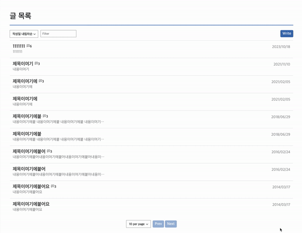

## INDEX
1. [How to run](#How-to-run)
1. [INSTALL.log](#INSTALL.log)


## Configuration
- Runtime : Node@18.9.0
- Compiler : typescript@5.0
- F/W : Next.js@13
- PackageManager : pnpm@8.9.2
- Style Lib : Emotion
- Testing : Jest


## How to run
### Install dependencies
```bash
nvm use 18 # nvm 이용 시 적용 (optional)
pnpm install # install dependencies
pnpm start # or pnpm dev
```

### Service URL
- Client: http://localhost:8000  
- Server(API): http://localhost:3000  

### Testing Script
```bash
pnpm test
```


## Structure

### Directories
```
|- public // Static
|- src
| |- app // JSX 페이지
| |- components // JSX 컴포넌트
| | |- Comment // 댓글 관련 컴포넌트
| | |- Editor // 위지윅에디터 관련 컴포넌트
| | |- Layout // 레이아웃 관련 컴포넌트
| | |- Loading // 로딩 관련 컴포넌트
| | |- Page // 페이지 컴포넌트
| | |- PasswordConfirm // 패스워드 컨펌창 컴포넌트
| | `- UI // 커스텀 엘리먼트 컴포넌트
| |- constants // 상수 선언
| |- hooks // 공통 훅 선언
| |- contexts // React Context 관련
| |- services // API 연동 관련 
| |- styles // 전역 스타일 선언
| |- types // 공통/일반 타입 선언
| `- utils // 공통 함수 선언
```

### Component Diagram


## INSTALL.log
Please see the INSTALL.log file.

